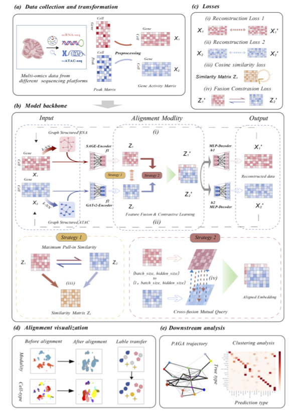

# scMGPF: A Deep Learning Model of Multi-Graph Cross-Fusion with Pulling for Efficient Alignment of Single-Cell Multi-Omics Data

[](https://www.python.org/)
[](https://pytorch.org/)
[](LICENSE)

## Overview

**scMGPF** is a deep learning framework designed for efficient alignment of single-cell multi-omics data, particularly for integrating single-cell RNA-seq (scRNA-seq) and single-cell ATAC-seq (scATAC-seq) data. The model leverages multi-graph cross-fusion with pulling mechanisms to learn shared representations while preserving modality-specific features.

This repository contains the implementation of scMGPF along with comprehensive evaluation scripts and comparisons with state-of-the-art methods.

## Framework

The overall architecture of scMGPF is illustrated in the framework diagram below:

<div align="center">
  
</div>


## Authors

- **Xiang Chen**
- **Zihan Yang**
- **Xiaoyu Liu**
- **Min Li**

## Features

- **Multi-Graph Architecture**: Utilizes GraphSAGE for RNA-seq data and GATv2 for ATAC-seq data to capture cell-cell relationships
- **Cross-Attention Fusion**: Implements cross-attention mechanisms for effective modality fusion
- **Comprehensive Loss Functions**: Combines reconstruction loss, contrastive loss, cosine alignment loss, and MMD loss
- **Efficient Alignment**: Achieves superior performance in cell-type clustering and label transfer accuracy
- **Benchmark Comparisons**: Includes implementations and comparisons with multiple state-of-the-art methods

## Installation

### Prerequisites

- Python 3.7 or higher
- PyTorch 1.8 or higher
- CUDA (optional, for GPU acceleration)

### Dependencies

Install the required packages using the requirements file:

```bash
pip install -r requirements.txt
```

Or install manually:

```bash
pip install torch torch-geometric numpy scipy pandas scanpy anndata scikit-learn matplotlib seaborn tqdm pyyaml munkres h5py
```

**Note:** For GPU support, install PyTorch with CUDA from the [official PyTorch website](https://pytorch.org/).

### Installation from Source

You can also install scMGPF as a package:

```bash
pip install -e .
```

## Project Structure

```
scMGPF/
├── scMGPF/              # Main model implementation
│   ├── model.py         # scMGPF model architecture
│   ├── layers.py        # Neural network layers (GraphSAGE, GATv2, etc.)
│   ├── losses.py        # Loss functions
│   ├── dataset.py       # Data loading utilities
│   ├── preprocess.py    # Data preprocessing
│   ├── evaluate.py      # Evaluation metrics
│   ├── utils.py         # Utility functions
│   └── main.py          # Main training script
├── config/              # Configuration files for different datasets
│   ├── Tea_PBMC.yaml
│   ├── CITE_PBMC.yaml
│   ├── AdBraCor.yaml
│   ├── P0BraCor.yaml
│   └── BMMC_s1d1.yaml
├── data/                # Data loading scripts
├── eva/                 # Evaluation scripts
├── vis/                 # Visualization scripts
├── logs/                # Model checkpoints (gitignored)
├── compared_method/     # Comparison methods implementations
│   ├── JointMDS/
│   ├── MMDMA/
│   ├── Pamona/
│   ├── SCOT/
│   ├── UnionCom/
│   ├── scTopoGAN/
│   ├── scMGCL/
│   └── scPairing/
├── .gitignore           # Git ignore rules
├── .gitattributes       # Git attributes for line endings
├── requirements.txt     # Python dependencies
├── setup.py             # Package setup script
├── LICENSE              # MIT License
├── CONTRIBUTING.md      # Contribution guidelines
├── fig-framework.png    # Framework diagram
└── README.md            # This file
```

## Usage

### Data Preparation

Prepare your data in AnnData (`.h5ad`) format:
- RNA-seq data: `raw_data_rna.h5ad`
- ATAC-seq data: `raw_data_atac.h5ad`

Each AnnData object should contain:
- `.X`: Feature matrix (cells × features)
- `.obs['clusters']`: Cell type labels

### Configuration

Edit the configuration file in `config/` directory for your dataset. Example configuration (`config/Tea_PBMC.yaml`):

```yaml
dataset_name: Tea_PBMC
dataset_dir: ../data/Tea_PBMC/
dataset_type: RNA_ATAC
GAM_name: Signac
paired: True

n_high_var: 2000
hid_dim: 256
neighbors_mnn: 200
metric: cosine
use_rep: hvg_count

latent_dim: 32
k_neighbors: 10
k_clusters: 11

seed: 666
batch_size: 256
learning_rate: 0.003
weight_decay: 0.00001
epoch: 300
```

### Training

Run the main training script:

```bash
cd scMGPF
python main.py
```

Or modify the dataset name in `main.py`:

```python
dataset_name = "Tea_PBMC"  # or "CITE_PBMC", "AdBraCor", "P0BraCor", "BMMC_s1d1"
```

### Evaluation

Run evaluation scripts:

```bash
cd eva
python eva_Tea_PBMC.py  # Replace with your dataset name
```

### Visualization

Generate visualizations:

```bash
cd vis
python visual_Tea_PBMC.py  # Replace with your dataset name
```

## Model Architecture

scMGPF consists of:

1. **Graph Encoders**:
   - GraphSAGE encoder for RNA-seq data
   - GATv2 encoder for ATAC-seq data

2. **Cross-Attention Fusion Module**: Fuses representations from both modalities

3. **Decoders**: MLP decoders for reconstruction

4. **Loss Functions**:
   - Reconstruction loss (RNA and ATAC)
   - Contrastive loss
   - Cosine alignment loss
   - MMD loss (optional)

## Datasets

The model has been tested on the following datasets:
- **Tea_PBMC**: Paired PBMC dataset
- **CITE_PBMC**: CITE-seq PBMC dataset
- **AdBraCor**: Adult brain cortex dataset
- **P0BraCor**: P0 brain cortex dataset
- **BMMC_s1d1**: Bone marrow mononuclear cells dataset

## Comparison Methods

This repository includes implementations and comparisons with:
- JointMDS
- MMD-MA
- Pamona
- SCOT
- UnionCom
- scTopoGAN
- scMGCL
- scPairing

See `compared_method/README.md` for more details.

## Citation

If you use scMGPF in your research, please cite our paper. Citation information will be updated upon publication.

## License

This project is licensed under the MIT License - see the LICENSE file for details.

## Contact

For questions or issues, please open an issue on GitHub or contact the authors.

## Acknowledgments

We thank the developers of the comparison methods and the single-cell genomics community for their valuable contributions.

